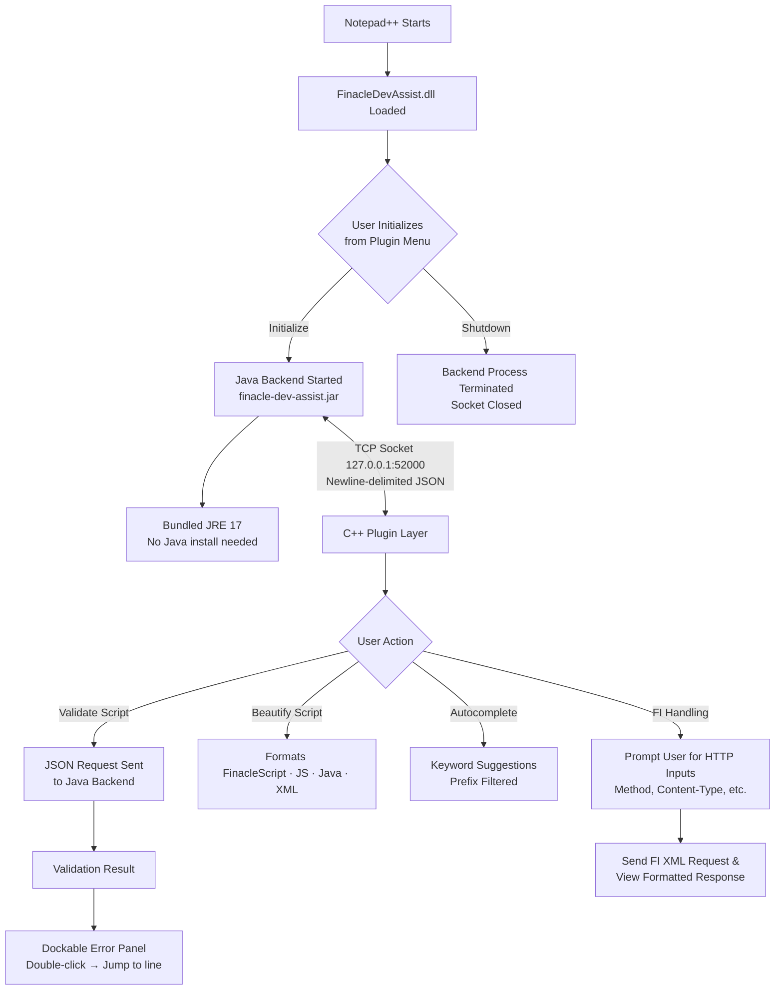

# FinacleDevAssist

> A Notepad++ plugin built to streamline and accelerate Finacle scripting development — for internal team use only.

---

## What is FinacleDevAssist?

FinacleDevAssist is a **Notepad++ plugin** that narrows down the Finacle scripting development cycle by providing real-time validation, formatting, and developer tooling — all running **fully offline** with no internet dependency during usage (with the exception of FI HTTP requests).

---

### Current Features

- **Script Validation** — Validate your Finacle script on demand; errors appear in a dockable panel and double-clicking any error jumps directly to that line
- **Script Beautifier** — Auto-formats and beautifies Finacle scripts, JS, Java, and **XML** files for clean, readable code
- **Autocomplete** — Intelligent keyword suggestions with prefix filtering as you type
- **FI Request / Response** — Send FI XML requests and view formatted responses directly inside Notepad++. Prompts you to input HTTP details (Method, Content-Type, etc.) before execution

---

## Installation

### Option A — Using the Installer (Recommended)

1. Download `FinacleDevAssist-Setup.exe` directly from this repository
2. Run the installer
3. Browse and select your `notepad++.exe` when prompted
4. Choose the release version to install
5. Click through — the installer handles everything automatically
6. Relaunch Notepad++; the plugin will now be ready to use.

> The installer requires internet access to fetch the release package from GitHub. After installation, the plugin runs fully offline.

---

### Option B — Manual Installation

1. Go to [Releases](https://github.com/santhoshswamyv/FinacleDevAssist/releases) and download the latest release ZIP
2. Extract the ZIP — you will get a `FinacleDevAssist` folder
3. Inside that folder, extract `jre-17.zip` in place (so `jre-17\bin\java.exe` exists)
4. Copy the entire `FinacleDevAssist` folder into your Notepad++ plugins directory:

```
<InstalledPath>\Notepad++\plugins\
```

5. Verify the following files exist after extraction:

```
plugins\
└── FinacleDevAssist\
    ├── FinacleDevAssist.dll
    ├── finacle-dev-assist.jar
    └── jre-17\
        └── bin\
            └── java.exe
```

6. Restart Notepad++ — the plugin will appear under the **Plugins** menu

---

## How It Works

The plugin does **not start automatically** when Notepad++ opens. The user initializes it manually from the plugin menu, and can shut it down the same way when done. Everything runs locally — no data leaves your machine unless you explicitly send an FI HTTP request.



---

## Upcoming Features

| Feature | Description |
|---|---|
| 📄 **Custom Menu File Generator** | Auto-generate Finacle menu files from script definitions |

---

## Contributing

Even though this is an internal project, contributions from team members are welcome.

### How to contribute

1. Reach out via the contact links below — discuss the feature or bug first before starting work
2. Follow the existing code structure:
   - C++ plugin layer lives in the DLL (socket lifecycle, UI panels, Scintilla integration)
   - All scripting logic lives in the Java JAR backend
3. Test against both dark and light Notepad++ themes
4. Keep it fully offline — no external API calls during normal plugin operation (excluding intentional FI request routing)

### Areas where help is needed

- Additional Finacle keyword definitions for autocomplete
- Test cases for the script validator
- Documentation for Finacle scripting patterns

---

## Requirements

- **Notepad++** — any recent version (64-bit recommended)
- **Windows** — 10 or later
- **Java** — bundled JRE 17 is included, no separate installation needed
- **Internet** — required during installation (to download the release package) and when explicitly sending FI HTTP requests

---

## 🔗 Links & Support

<a href="https://www.linkedin.com/in/santhosh-swamy-v-22ab6b234"></a>&nbsp;&nbsp;
<a href="https://instagram.com/sd._.sandy?igshid=MzRlODBiNWFlZA=="></a>&nbsp;&nbsp;
<a href="https://wa.me/+918754120190"></a>

> For bug reports or feature requests, open an [Issue](https://github.com/santhoshswamyv/FinacleDevAssist/issues) on this repository.

---

## ⚠️ Important Notice

This plugin is **not open source** and is intended **exclusively for use within our team / organization**.  
Redistribution, modification, or use outside the organization is **not permitted**.

> I do not own Finacle, Notepad++, or any third-party libraries used in this project. All respective trademarks and copyrights belong to their original owners. This plugin is an independent internal tooling effort and is not affiliated with or endorsed by Infosys or any Finacle product team.

---

## License

This software is proprietary and confidential. It is intended solely for use by authorized members of the organization. Unauthorized copying, distribution, modification, or use of this software, in whole or in part, is strictly prohibited.
